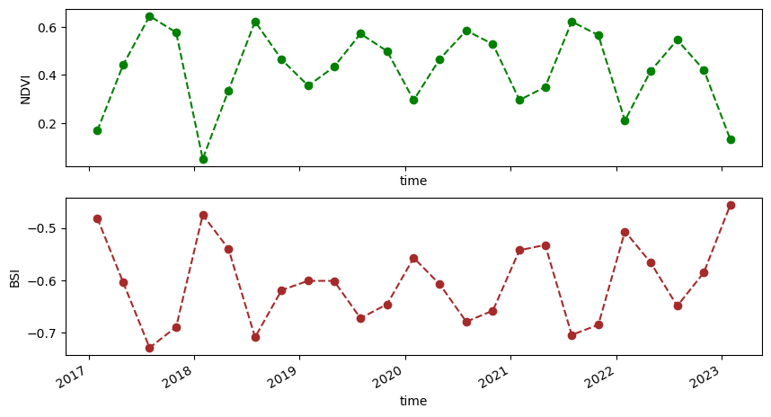

Please have a look at the Jupyter Notebooks at `S2_all_bands_download` as they document the generation of the dataset we'll be mostly using.  
Alsohave a look at the updated quicklook version of `S2_Frankenwald_HD_Showcase.ipynb` as this already comprises
some first results. I took the freedom to display them here in the README. For as selected
region (my hometown, more or less) a significant raise in Bare Soil Index (BSI) and a decline of NDVI
can be seen. 

(1) To create enviroment for Forest_Vs_BareSoil notebook.
conda install -c conda-forge dask 
conda install -c conda-forge pystac_client
conda install -c conda-forge cartopy
conda install -c conda-forge planetary-computer
conda install -c conda-forge stackstac
conda install -c conda-forge rasterio
conda install -c conda-forge ipykernel
conda install -c conda-forge geojson

(1) To create enviroment for GeoJSON CRS Converter.
conda install -c conda-forge ipykernel
conda install -c conda-forge geojson
conda install -c conda-forge pyproj

