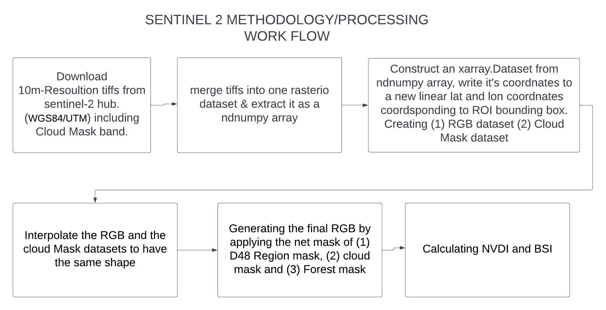

  

The directory contains the following files:

- `README.md`: This file contains information about the other files in the directory, including a brief explanation of their purpose.

- `s2_download.py`: This is a Python script that downloads Sentinel-2 satellite imagery from the European Space Agency's Copernicus Open Access Hub by using the SentinelHub library. The script first sets up an SHConfig object and checks for the presence of the OAuth client ID and secret. It then imports various modules from the SentinelHub library and defines two evalscripts, one for the Cloud Mask (CLM) band and one for all bands. The script also defines a bounding box and resolution for the Frankenwald/Türingerwald  region in Germany from the `/Layers/D48.shp` shapefile. It creates a list of time intervals with a frequency of one week, between start date of 2017 and end date of 2022. The script then iterates over the list of time intervals, creates a SentinelHubRequest object for each interval and the requests are sent to the Copernicus Open Access Hub to download the images. The downloaded images are saved in the specified data folder.
It defines a function `get_request_dt(request_file)` that takes in a request file and reads the time from the json file.
The script then uses the glob library to get a list of all the subfolders in the current working directory. It iterates over the list of folders and for each folder it calls the get_request_dt function to extract the time from the `request.json` file. It then uses the datetime module to convert the time string to a datetime object and formats it to the desired format. The script then renames the folder to this formatted date. If the folder does not contain a request.json file, it will skip it and print 'no request.json'. The files can be found at the SC-Cluster: '''/work/users/jn906hluu/S2_Frankenwald/'''.

- `s2_download_hd.py`: Same as `s2_download.py` but downloading a mosaic of 60 images of the region to increase resolution. This upscales the image from ~ 1500 x 2000 pixel tp 7500 x 11500 pixel. The script takes roughly 60h to run with current configuration (~320 timesteps)

- `rename.py`: This script is used to rename the folders containing the images downloaded using the `s2_download.py` script. The script starts by changing the current working directory to the folder where the images are stored.

- `s2_download.ipynb`: This is a Jupyter notebook that contains the same functionality as the `s2_download.py` script, but with additional explanations and visualizations.

- `tiff_to_xarray.py`: The script is performing various operations on remote sensing data and shapefiles. The first step is to set the paths to the required files. The next step is to read the data in RGB and CM format. The RGB data is then merged to form a single data array. The CM data is also merged to form another data array. The merged RGB data is then converted into a xarray dataset and the CM data is converted into another xarray dataset. The two xarray datasets are then interpolated to the same spatial resolution. The shapefile is then read using geopandas and is transformed to match the CRS of the example raster file. The final step involves masking the RGB xarray dataset using the shapefile and the CM xarray dataset. The masked data is then saved to a specified output location

