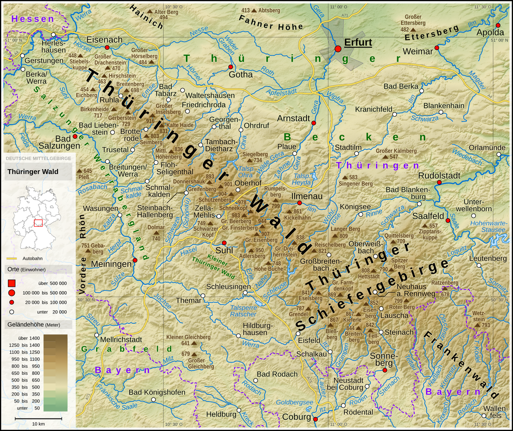

# Forest Cover (FC) change in a small mountain range in the middle of Germany:

A case study of the thuringa/ franconian forest

General Plan of Action:

1. Choosing the right dataset (probably S2 data)
2. Choosing the region: here is a image of the region I have in my mind. I think we should start with a rectangle spanning from Naila to Eisenach.

  + 

So, i think the ares we should look at are (odered by a somehow arbitrary hierarchy):

1. Frankenwald (franconian forest)
2. Thüringisches/Fränkisches Schiefergebirge (thuringia/ franconian slate mountains)
3. Thüringer Wald (thuringia forest)
4. Fichtelgebirge (fichtel mountains)

I would leave out the vogtland (i don't have to much of reason for it, but i don't think it's too much connect to the before mentioned). I included the fichtel mountains as they've seen quite some forest cover loss in the past 5 years too.

3. Mask the region for forest/urban area:

→ get the region of franconian forest

→ retrieve a filter function/ binary masked that is gridded over lat / lon

4. Time axis:

Main Problem: cloud cover → have to look for cloud free mosaics

Choose best pixel values for summer (something between JJAS), for

each year of the available years. Depending on the dataset we have to see what's possible

5. Variables:

We agreed that the NDVI will be our primary source for deriving the state of forest. We'll correlate the derived values with SPEI index and soil moisture.

| **Variable** | NDVI | SPEI | soil moisture |
| --- | --- | --- | --- |
| **use case** | state of trees, condition of trees | general enviromental condtions, measure for draught stress on trees | another way to look at the effective drought stress on the trees |
| **notes** |

**Meeting 23.12.22 12:00**

-We agreed on a region. The shapefile will be uploaded to the repository (still in the making)

-Marwa will focus on the high level landuse products and already get us some metrics (percentage of forest cover change, etc.)

-Josh will automate a routine to get Sentinel-2 Level 2 data to extract RGB/ different bands (and maybe have expanded timeseries).

18th Feb
Josh had finshed: 
- mosics
- tiff to zarr
- final dataset
- Ability to calcute ndvi and baren soil indix

What to focus on:
- other indices? (search) https://custom-scripts.sentinel-hub.com/custom-scripts/sentinel-2/indexdb/
- read github code
- land cover heatmap (marwa)
- start writing (overleaf)
- add lit

Next meeting? 23rd Feb 10:30 (GMT 1:00)?

Meeting notes: 03.03.2023

Decided on when to end pre-processing of data (09.03.2023) ---> no more processing, formatting - everything should be readable and runnable by then.

El: finish the soil moisture dataset (transform x,y to lat lon) and upload to work server, and add notebook notes to overleaf. add marwa to overleaf doc
josh: finish temp and precip datasets, make bib file, add references
Marwa: Maintainance starts 21.03 --> back up data and code to harddrive!!

everyone: add references you used/read

to do:  
do time series, look for correlations (lags?) --> produce nice plots basically
focus on overleaf doc

goal: by 21.03 have a working and basically finished version (24.03 is the due date!)

09.03 Meeting:

urgently need to create structure for the paper. this involves:
- settle objectives such that we can refer to them for our analysis
- clean up the paper so far: josh - mostly introduction, motivation, and objectives. add to processing sentinel data el: mostly theoretical framework, and processing dwd data section 
- use bibliography --> secondary references in i.e. thonfeld paper, potentially bark beetle paper
- make the index a nice full page table with description and references
- add/remove/restructure sections and subsections

look at bark beetle paper indices and compare to josh's computed indices to see if some can idicate BB infestation

clean up operation:
theoretical framework: add a few sentences about sentinel-2 (that its a satellite and flies), what kind of product we used (L2?) , cite ESA?

ultimately remove most subsections in content page; leave for now for better overview of structure

